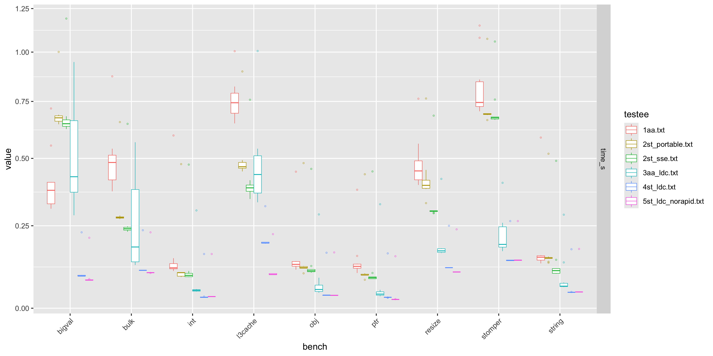

# Swiss Tables benchmark

Copied from [Druntime's benchmark](https://github.com/dlang/dmd/tree/master/druntime/benchmark) for comparison with built-in AA.
Here is the result on Mac M1 16GB machine:

- 1aa: dmd and built-in AA
- 2st_portable: dmd and Swiss Tables with portable implementation
- 2st_sse: dmd and Swiss Tables with SIMD/SSE2 implementation
- 3aa_ldc: LDC and built-in AA
- 4st_ldc: LDC and Swiss Tables
- 5st_ldc_norapid: LDC and Swiss Tables without rapidhash

Currently, Swiss Tables doesn't use SIMD/SSE2 for LDC because it becomes slow.
Need more LDC knowledge, e.g. IR.
